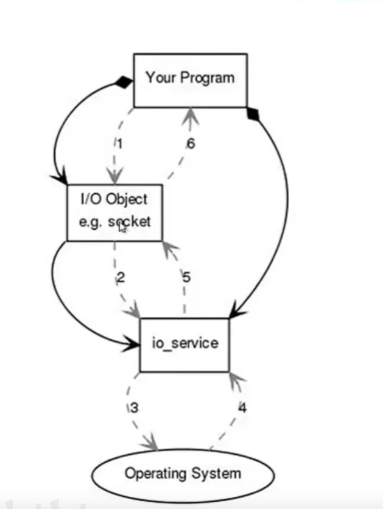
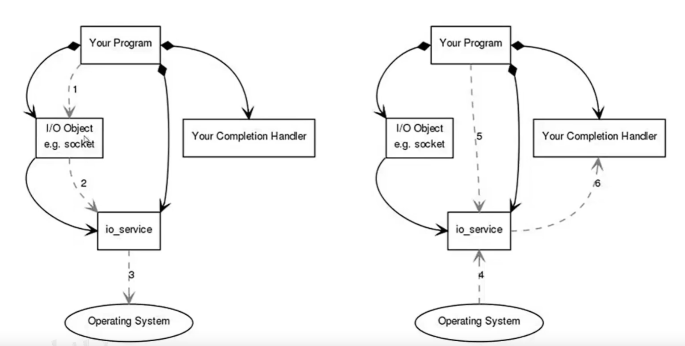

# 环境的使用

```bash
# 操作系统
Ubuntu Server
# VimPlus插件：https://github.com/IceLeeGit/VimPlus

# 编译器gcc
```

# C++ 关键字

``` C++
// alignas 指定对齐方式
// alignof 获得对齐方式
struct alignas(8) S{};                                                       
struct alignas(1) U{S s;};  
cout << alignof(U) << endl; 


// bool值一般是一个字节
// 不要对一个变量重新换指针变量类型引用：reinterpret_cast<char*>(bool obj);
// bool 最好不要作为函数的参数使用


// constexpr的使用：限定了编译器常量
// 如果表达式在编译器就能确定值，在编译器就会求出该值；
// 如果表达式不能再编译器确定值，就将表达式作为普通的表达式使用
constexpr int fact(int n){                                                   
     return n<1?1:n*fact(n-1);                                                
}  
// 由此函数，就可以方便的在编译的时候就能得到某个阶乘值


// dynamic cast 的使用，用于父子类之间
 Par* p =  new Child();                                                   
if(Child* res = dynamic_cast<Child*>(p)){                                
   res->t();                                                            
}  

// C++11 版本的enum
// bool 类型不应该出现在函数传参中
void show(bool isGood,bool isOK){                                            
    return;                                                                  
}                                                                            
                                                                              
void testShow(){                                                             
    show(true,false); // 调用时可读性不好
}
// enum class的用法
enum class Good{                                                             
    True,False                                                               
};                                                                           
                                                                             
enum class OK{                                                               
    True,False                                                               
};                                                                           
                                                                             
void show(Good,OK){                                                          
    return;                                                                  
}                                                                            
                                                                             
void testShow(){                                                             
   show(Good::True,OK::False);                                              
} 

// static_assert和assert
// static_assert可以在编译器处理，assert可以在运行时处理
// 如：变量是从cin得到,则编译器无法对变量值进行处理


// C++11 左值和右值
// 左值有名字、有类型、有值，右值没有名字，不能做取地址操作;
// 可以定义右值引用如 int&& c = 1;
// std::move 不会将一个变量中的内容移动到另一个变量中，唯一的功能是将左值转化为右值，让右值引用可以指向左值

// 不使用编译器自动生成的析构函数，自己手动声明出；
// 析构函数不要抛出异常!!! 
// C++ 默认的析构函数inline noexcept(ture)
class A {
public:
    // 强制修改noexcept为false导致未知错误、在try catch代码块中可能同时出现两个异常无法处理，以及资源无法释放的问题
    ~A() noexcept(false){ throw "123"; }
};

void testA() {
    try {
        A a;
        A b;// 此处会抛出两个异常并非只有一个throw "123"
    } catch (...) {
        cout << "find a error!" << endl;
    }
}

// 在构造函数中使用异常是一个好习惯，但C++很少使用try catch

// oo编程在网络编程领域使用不多，在游戏开发领域是个不错的选择

// 父类的析构函数应为virtual：
// 当用父类指针Base*指向子类Derived*对象实现多态时，delete 释放空间
// delete base和delete derived是有区别的
// 如果Base的析构函数是virtual,则二者相同;
// 如果Base的析构函数是非virtual，delete base只会调用父类的析构函数，可能造成内存泄漏

// 在构造函数中/析构函数中调用虚函数不具有多态性，调用本类的函数

// 容器iterator使用前置++效率更高 ++iter

// 在析构函数中加输出检查是否正常调用析构

// 在#include<assert.h>前定义宏#define  NDEBUG，可以使所有的assert语句失效，生成release版本程序
```

# 智能指针

```c++
// shared_ptr作为函数参数传递时最好采用const引用的形式减少引用计数，
// 智能指针存在循环引用的情况时，会发生内存泄漏
// weak_ptr的存在就是为了打破这种循环引用的局面！将其中一个智能指针设为weak_ptr类型

// 定义shared_ptr指针时，使用make_shared<T>(par)效率更高

// 使用优先级
直接定义类对象(非动态类型) >> unique_ptr >> shared_ptr
    
    
// 使用weak_ptr存储数据的性能消耗非常大，先lock再解引用获得数据耗费的性能是shared_ptr的十倍
```

# ASIO库

## 模型

### 同步编程模型:(Reactor事件驱动)



> Lighthttpd,libevent,libev,poco

### 异步编程模型:(Proactor模型)



> Asio,locp


